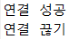
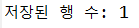
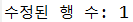
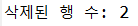
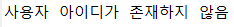
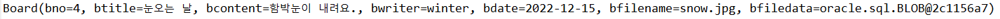
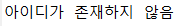
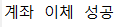
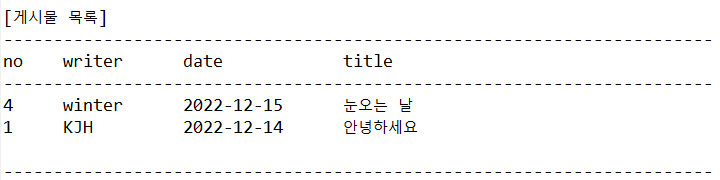

# 개인 프로젝트

```
** 오라클 이클립스 연결

try {
			//JDBC Driver 등록
			Class.forName("oracle.jdbc.OracleDriver");

			//연결하기
			conn = DriverManager.getConnection(
					"jdbc:oracle:thin:@localhost:1521/XE",
					"java",
					"oracle"
					);

```
###### 실행결과

-----------------------------------------------------------------------------------------------------------
```
** 저장된 행 수 출력

	//매개변수화된 SQL 문 작성
			String sql = "" +
				"INSERT INTO users(userid, username, userpassword, userage, useremail)" + "VALUES(?, ?, ?, ?, ?)";
			
			//PreparedStatement 얻기 및 값 지정
			PreparedStatement pstmt = conn.prepareStatement(sql);
			pstmt.setString(1, "winter2");
			pstmt.setString(2, "한겨울");
			pstmt.setString(3, "12345");
			pstmt.setInt(4, 25);
			pstmt.setString(5, "winter@mycompany.com");
			
			//SQL 문 실행
			int rows = pstmt.executeUpdate();
			System.out.println("저장된 행 수: " + rows);

```
###### 실행결과

-----------------------------------------------------------------------------------------------------------
```
** 수정된 행 수 출력

//PreparedStatement 얻기 및 값 지정
			PreparedStatement pstmt = conn.prepareStatement(sql);
			pstmt.setString(1, "눈사람");
			pstmt.setString(2, "눈으로 만든 사람");
			pstmt.setString(3, "snowman.jpg");
			pstmt.setBlob(4, new FileInputStream("src/project/snow.jpg"));
			pstmt.setInt(5, 3);  //boards 테이블에 있는 게시물 번호(bno) 지정
			
			//SQL 문 실행
			int rows = pstmt.executeUpdate();
			System.out.println("수정된 행 수: " + rows);
```
###### 실행결과

-----------------------------------------------------------------------------------------------------------
```
** 삭제된 행 수 출력

//매개변수화된 SQL 문 작성
			String sql = "DELETE FROM boards WHERE bwriter=?";
			
			//PreparedStatement 얻기 및 값 지정
			PreparedStatement pstmt = conn.prepareStatement(sql);
			pstmt.setString(1, "winter");
			
			//SQL 문 실행
			int rows = pstmt.executeUpdate();
			System.out.println("삭제된 행 수: " + rows);
```
###### 실행결과

-----------------------------------------------------------------------------------------------------------
```
** 사용자 아이디 존재 여부 출력

//PreparedStatement 얻기 및 값 지정
			PreparedStatement pstmt = conn.prepareStatement(sql);
			pstmt.setString(1, "winter");
			
			//SQL 문 실행 후, ResultSet을 통해 데이터 읽기
			ResultSet rs = pstmt.executeQuery();
			if(rs.next()) {						//1개의 데이터 행을 가져왔을 경우
				User user = new User();				
				user.setUserId(rs.getString("userid"));
				user.setUserName(rs.getString("username"));
				user.setUserPassword(rs.getString("userpassword"));
				user.setUserAge(rs.getInt(4));       //컬럼 순번을 이용
				user.setUserEmail(rs.getString(5));  //컬럼 순번을 이용				
				System.out.println(user);
			} else {                           //데이터 행을 가져오지 않았을 경우
				System.out.println("사용자 아이디가 존재하지 않음");
			}
			rs.close();
```
###### 실행결과

-----------------------------------------------------------------------------------------------------------
```
** 게시판 내용 출력

//PreparedStatement 얻기 및 값 지정
			PreparedStatement pstmt = conn.prepareStatement(sql);
			pstmt.setString(1, "winter");
			
			//SQL 문 실행 후, ResultSet을 통해 데이터 읽기
			ResultSet rs = pstmt.executeQuery();
			while(rs.next()) {		
				//데이터 행을 읽고 Board 객체 생성
				Board board = new Board();
				board.setBno(rs.getInt("bno"));
				board.setBtitle(rs.getString("btitle"));
				board.setBcontent(rs.getString("bcontent"));
				board.setBwriter(rs.getString("bwriter"));
				board.setBdate(rs.getDate("bdate"));
				board.setBfilename(rs.getString("bfilename"));
				board.setBfiledata(rs.getBlob("bfiledata"));
				
				//콘솔에 출력
				System.out.println(board);
```
###### 실행결과

-----------------------------------------------------------------------------------------------------------
```
** 아이디 존재 여부 

//매개변수화된 호출문 작성과 CallableStatement 얻기
			String sql = "{? = call user_login(?, ?)}";
			CallableStatement cstmt = conn.prepareCall(sql);
			
			//? 값 지정 및 리턴 타입 지정
			cstmt.registerOutParameter(1, Types.INTEGER);
			cstmt.setString(2, "winter");
			cstmt.setString(3, "12345");
			
			//함수 실행 및 리턴값 얻기
			cstmt.execute();
			int result = cstmt.getInt(1);
			
			//CallableStatement 닫기
			cstmt.close();
			
			//로그인 결과(Switch Expressions 이용)
			String message = switch(result) {
				case 0 -> "로그인 성공";
				case 1 -> "비밀번호가 틀림";
				default -> "아이디가 존재하지 않음";
			};
```
###### 실행결과

-----------------------------------------------------------------------------------------------------------
```
** 계좌이체 성공 여부

//출금 작업
				String sql1 = "UPDATE accounts SET balance=balance-? WHERE ano=?";
				PreparedStatement pstmt1 = conn.prepareStatement(sql1);
				pstmt1.setInt(1,  10000);
				pstmt1.setString(2, "111-111-1111");
				int rows1 = pstmt1.executeUpdate();
				if(rows1 == 0) throw new Exception("출금되지 않았음");
				pstmt1.close();
				
				//입금 작업
				String sql2 = "UPDATE accounts SET balance=balance+? WHERE ano=?";
				PreparedStatement pstmt2 = conn.prepareStatement(sql2);
				pstmt2.setInt(1,  10000);
				pstmt2.setString(2, "222-222-2222");
				int rows2 = pstmt2.executeUpdate();
				if(rows2 == 0) throw new Exception("입금되지 않았음");
				pstmt2.close();
			
				//수동 커밋 -> 모두 성공 처리
				conn.commit();
				System.out.println("계좌 이체 성공");	
```
###### 실행결과

-----------------------------------------------------------------------------------------------------------
```
** 게시물 목록

public void list() {
		//타이틀 및 컬럼명 출력
		System.out.println();
		System.out.println("[게시물 목록]");
		System.out.println("-----------------------------------------------------------------------");
		System.out.printf("%-6s%-12s%-16s%-40s\n", "no", "writer", "date", "title");
		System.out.println("-----------------------------------------------------------------------");
		
		//boards 테이블에서 게시물 정보를 가져와서 출력하기
		try {
			String sql = "" +
				"SELECT bno, btitle, bcontent, bwriter, bdate " +
				"FROM boards " + 
				"ORDER BY bno DESC";
			PreparedStatement pstmt = conn.prepareStatement(sql);
			ResultSet rs = pstmt.executeQuery();
			while(rs.next()) {		
				Board board = new Board();
				board.setBno(rs.getInt("bno"));
				board.setBtitle(rs.getString("btitle"));
				board.setBcontent(rs.getString("bcontent"));
				board.setBwriter(rs.getString("bwriter"));
				board.setBdate(rs.getDate("bdate"));
				System.out.printf("%-6s%-12s%-16s%-40s \n", 
						board.getBno(), 
						board.getBwriter(),
						board.getBdate(),
						board.getBtitle());
			}
			rs.close();
			pstmt.close();
		} catch(SQLException e) {
			e.printStackTrace();
			exit();
		}
```
###### 실행결과

-----------------------------------------------------------------------------------------------------------
